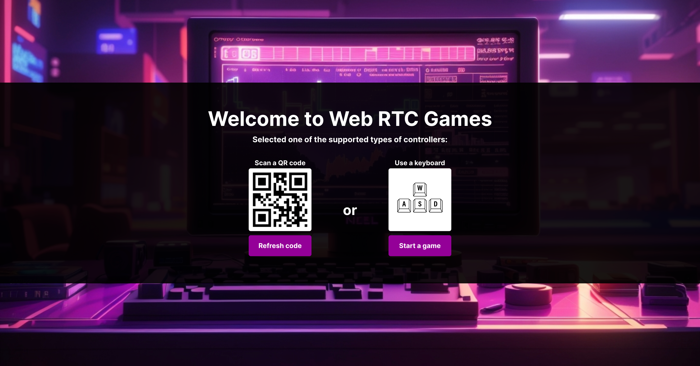

# Web RTC Games

The games with remote (and wireless 😛) game-pad support.

## Description

The app's purpose is to learn the Svelte framework and Web RTC communication.

## Demo

A demo is available at [https://web-rtc-games.vercel.app](https://web-rtc-games.vercel.app).

## Screenshots

## Used technologies

- 🎁 Repository: regular Git repository
- 🧰 Frameworks: Svelte and Vite build system
- 🛠️ Tools: not yet
- 🎨 Styling: standard CSS
- 💎 Others: desktop-first approach, web RTC communication, leonardo.ai

## How to start

1. Clone the repository.
2. Install node.js and npm.
3. Install dependencies with `npm install`.
4. Run the project with `npm run dev`.
