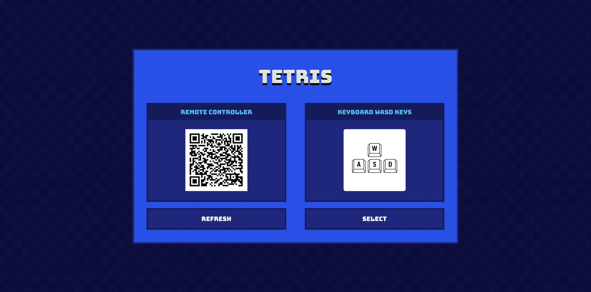
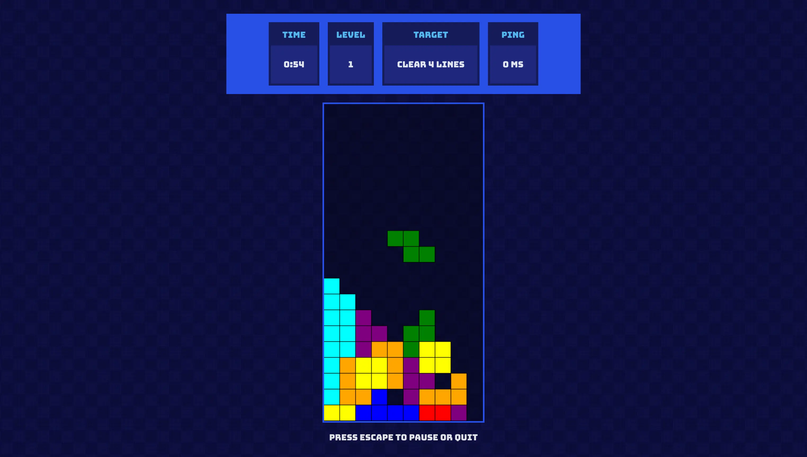

# WebRTC Tetris

The Tetris game with a remote controller support.

## Description

The app's purpose is to learn the Svelte framework and WebRTC communication.

## Demo

⚠️ Use Google Chrome, other browsers might not work ⚠️

A demo is available at [https://web-rtc-tetris.vercel.app](https://web-rtc-tetris.vercel.app).

## Screenshots

### Landing page

### Game play

### Game over

### Remote controller

## Used technologies

- 🎁 Repository: regular Git repository,
- 🧰 Frameworks: Svelte and Vite build system,
- 🛠️ Tools: canvas, svelte qr code, socket.io, express.js,
- 🎨 Styling: standard CSS,
- 💎 Others: desktop-first approach, WebRTC communication.

## Encountered problems and its solutions

### Image `<map>` is not responsive

The HTML `<map>` tag defines an image map, but the defined elements are based on pixels, so it does not support scaling up and down with a responsive image.

The solution is to define an SVG transparent image, definite the elements above the controller's button, and place the SVG on top of the controller's picture using the `position: absolute` declaration.

### WebRTC's offer and answer have to be exchanged manually

The WebRTC provides interfaces and methods to establish the peer-to-peer connection but does not provide any solution to exchange the initial data (offer, answer, and ice candidates) between the peers.

The solution is to define a simple express.js server. The game landing page generates the offer and sends it to the server via Web Socket. When the user scans the QR code and navigates to the controller's view, its logic generates a GET request to fetch the offer object, accepts it, and generates the answer sent as a POST request's payload to the server. Finally, the game landing page is notified by the server via Web Socket that the answer is ready.

## How to start

1. Clone the repository.
2. Install node.js and pnpm.
3. Update the values in the `.env` file.
3. Install dependencies with `pnpm install`.
4. Run the server with `pnpm run dev:api`.
4. Run the project with `pnpm run dev`.
